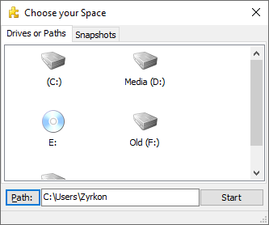

# Backup of your Data (copy and paste method)

consideration and awareness

***

## Backup in General

!!! danger "Important"
    If you want to use a USB Flash Drive to install Windows 10 **and** also use the free space of the same USB Flash Drive, you need to jump setup the Windows installer first, as this will format the Flash Drive. You can then use the available space on the USB Flash Drive.

You are aware that you want to re-format your Main Hard Drive Partition (the one that contains a previous version of MS Windows or another Operating System) with a new File System and a fresh Installation of MS Windows 10. Therefore, you need to save all the old data first.

This **excludes** all installed Applications and Games, the Windows Registry and Restore Points of your current Operating System. However, your Application Settings can be saved and later restored (for most applications).

Let's open the overview of your available Hard Disk Partitions under Windows by pressing the `⊞ Win` Key on your Keyboard or clicking the Symbol in your Taskbar to open the Windows Start Menu. There, select 'This PC', and a new window will show up. Here an example:

!!! warning "Note"
    If you have only one Hard Drive Partition available, namely 'Local Disk (C:)', you have to be acutely aware that installing Windows 10 on this partition will wipe the File System and therefore also delete all data.

All files that need to be copied from 'Local Disk (C:)' should be contained in `C:\Users\'Username'\`. In the Explorer Window that we just opened, `double-click` on 'Local Disk (C:)', then navigate (by double-clicking) to the `C:\Users\` Folder. `Right-click` on your `C:\Users\'Username'\` Folder to open the Context-Menu, select (click) 'Properties' like so

And a new window will open, showing you the basic Properties of this Folder. Most important is the 'Size on disk' value. Here is an example from a live System

This Folder can contain everything from 2-3 GB, up to an obscene amount of data. This data needs to be saved. This means you need at least this amount of available space, somewhere **not** on 'Local Disk (C:)'. It can be one of:

- another internal Hard Disk
- an external Hard Disk / SSD
- USB-Stick or
- writeable media, such as writable Blu-ray Discs (needs BD-ROM drive).

Anything is fine as long as it can hold the amount of data shown on _your_ `C:\Users\'Username'\` folder.

If there is no such option readily available, then there are two things that can still be done about it:

* find out what takes up a lot of space, and consider if you need this Data in the future. If not, delete it
* Split a portion of your File-System into a new, temporary Partition and copy the Folder there. This Partition will not be
touched during the installation of MS Windows 10.

A nice, free tool to visualize which subfolders of `C:\Users\'Username'\` take up a lot of space, and might not needed for a Backup,
is called [SpaceSniffer](http://www.uderzo.it/main_products/space_sniffer/index.html). Download it, start the Application and point it
at your `C:\Users\'Username'\` Folder, like so:

Let it run for a while, until there are no more big changes to the picture. Let's have a look at the view of my `C:\Users\Zyrkon\` Folder:

