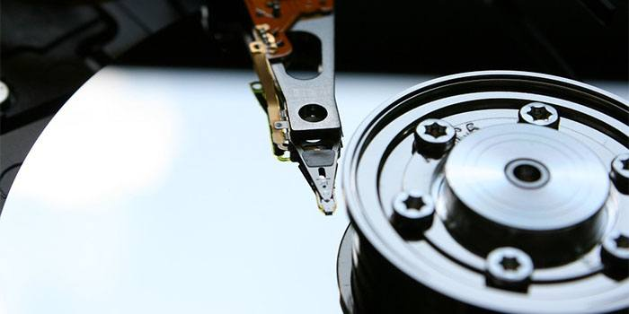
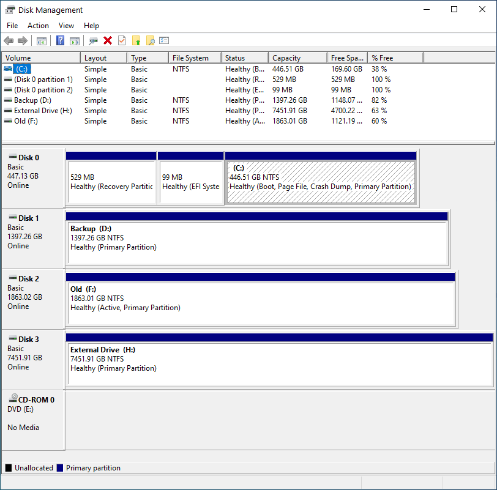
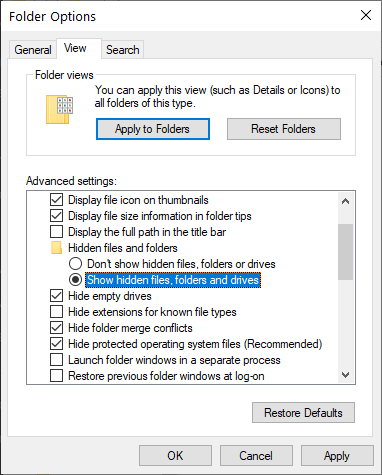

# About Hard Drives, Partitions and Programs

All the things you need to know to avoid confusion

***

## Hard Drive / Disk

A Hard Drive is a physical device that's used to store data. It's not a standard term but a commonly-used one. While the strictest definition would be the physical device that stores data, it is often used informally to refer to any storage device, from a disk to a volume. Technically, its meaning is restricted to describing a hardware device.

It is the device that you buy in your computer store. Current typical examples for hard drives are the big, clunky Hard Disk Drives (HDD), Solid State Disks (SSD) and M.2 SSD's, also known as PCI Express NVMe SSD's.

But it is not what you are directly working on when you work on your PC. For any operating system to perform read and write data from a hard drive, the hard drive needs a filesystem.

## Partitions and Filesystems

The typical filesystem for Windows 7/8/10 is called NTFS. The (very) outdated filesystem from yesteryear is called FAT32, mostly used in Windows XP and below. A modernized version of FAT32 is called exFAT, mainly used as an optional filesystem for USB Flash Drives.

Here is the crucial part:

**A hard drive can contain a partition that spans over the entire disk or contains multiple, separate partitions. It is commonly referred to as *partitioning*. To be more precise: A partition is a chunk of hard drive that contains a filesystem.**

This is, in itself, a straightforward concept to understand. However, it gets confusing in Windows because Microsoft decided to make everything user-friendly and hide this from the standard view.

When you open `Your PC` Window (from the Start Menu), Windows will show you your **partitions**, as well as all connected Flash Drives, mounted Virtual Disks as well as Floppy Disk Drives and CD/DVD/BD Drives.

Here is an example:

It shows the physical BD-RE Drive, but only partitions, and then calls them "Disk", which can lead to confusion and problems later, when we need to re-format the *partition* that contained the old  Operating System.

In the picture above, you can see multiple disks, and it looks like they all might be partitions that span entire Hard Disks, but it would be equally possible that "Backup" and "Old" are just two partitions on a 4TB HDD. It is impossible to tell.

To see what's going on, we need to open the Windows Disk Manager. To do this, we start with opening the Start-Menu by pressing
`⊞ Win` or the Run-Menu by pressing `⊞ Win + R` and type `diskmgmt.msc` and press Enter.

Alternatively, you can open the Start-Menu and navigate to `Control Panel` > `Administrative Tools` > `Computer  Management`. Inside
`Computer Management` you can select `Disk Management` and will be greeted with a window displaying all the physical Hard Drives in the computer, as well as the partitions and their file system on them. In my example, it looks like this:

Here we can see that, yes, the partitions span the entire physical Hard Drives. Let's ignore the small partitions on the system drive, as this is
something that Windows will automatically do during the installation.

Keep your Hard Disk and partition layout in mind; you will need it later.

## Programs, Files and %APPDATA%

Let's talk about programs for a bit. If we ignore portable programs, then the standard programs (or games) come with an Installer, which typically installs many files in a directory of your choice, by default the `C:\Programs` or `C:\Programs (x86)` Folders on the Systems partition (C:). A program (or game) that comes with an installer usually includes multiple executable files, like the main program, an updater and an uninstaller.

For some programs, the configuration can be unimportant or is quickly set up. Examples are Libre Office and Microsoft Office.

However, for some programs and especially games, the configuration can either require a long time to set up or outright need keys and files that cannot easily be replaced. For example, customized User Interfaces in games, the Server list for Teamspeak- or IRC Clients, SSH private keys for Github Repositories, AES private keys for GnuPG and Mail.

And how do you save Website Passwords? Is it within the Webbrowser directly, a Browser-Plugin using encrypted Cloud Storage, or on stacks of paper notes stuffed together in the upper desk drawer?

**But where do all the programs save the configurations and essential files?**

And the answer is `%APPDATA%`, a System variable that links to `C:\Users\<Username>\AppData\`. However, you can open the Windows File Explorer (open the Start Menu with `⊞ Win` and type File Explorer) and type `%APPDATA%` and press `Enter` to enter said folder. However, when you navigate to `C:\Users\<Username>\`, the AppData folder has become invisible.

The AppData folder is hidden from the normal view to prevent normal users from accidentally deleting the folder and loose all their valuable program configurations. The File Explorer can access the option to display hidden files and folders. Inside the File Explorer, select `View` > `Options` > `Change folder and search options` and a option window will appear. Select the `View` Tab. Somewhere in the options list (depending on your current Windows version) will be the option `Show hidden files, folders and drives`.

The AppData Folder will show up now.

**This is important since installing a new Windows will delete all the data on the partition, and programs (and games) cannot just be copied somewhere else and then copied back. They all need to be re-installed, too. However, your AppData Folder can be copied and saved, together with all other folders and files inside the `C:\Users\<Username>\` directory. It can only be selected and copied if it isn't hidden from view.**
