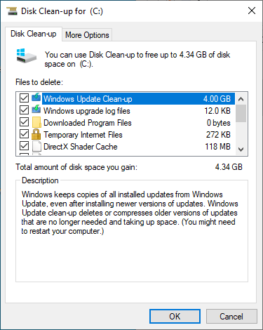

# Find Space

by reducing or deleting unnecessary files

***

## Having a first look
If we want to find the big eaters of space hidden or forgotten inside a specific folder or partition, we need a way to visualize the size
of all subfolders in an easy to use manner. This is especially so for the  `C:\Users\'Username'\AppData` folder.

A nice, free tool to visualize which subfolders of `C:\Users\'Username'\` take up a lot of space, and might not be needed for a Backup,
is called [SpaceSniffer](http://www.uderzo.it/main_products/space_sniffer/index.html). Download it, start the application and point it
at your `C:\Users\'Username'\` folder, like so:

Let it run for a while until there are no more big changes to the picture. Let's have a look at the view of my `C:\Users\Zyrkon\` Folder:

Each square represents a folder (or subfolder) and the size of said folder. The size of each square also represents the size in relation to
all other folders. The bigger the square, the more space it needs. In my example, the folder `C:\Users\'Username'\AppData\Local\ModOrganizer`
contains 12.1 GB worth of Skyrim Mods. A game I long since uninstalled and forgotten. This is a folder that I know I can delete because I
know what it contains, and I know I do not need it any longer.

The next biggest square in SpaceSniffer is the folder `C:\Users\'Username'\AppData\Local\Spotify`. In this case, I am not so sure of the content, but
I am sure that Spotify itself only needs 100 MB or 200 MB in itself. As a music streaming service, I suspect that most of the 6.8 GB of data contains temporary files from music streaming. Clicking on the Spotify-square inside SpaceSniffer will focus on the Spotify folder as the base. And certainly enough, the `Data` subfolder contains almost all the data. Using a Google search for making sure (ex.: 'Can I delete the Spotify data folder'), I find that yes, I can delete the content of the `Data` folder (but not the folder itself).

The general rule for cleaning up your filesystem in this way is to delete folders or files when you are confident that you can do so. If you do not know what the files do, you should not delete them.

## Three easy ways to make space

1. Open the Recycle Bin on your Desktop, check the content to make sure all files can be irrevocably deleted, and click the `Empty Recycle Bin`- Button.

2. From the `This PC`-Window we can right-click on `Local Drive (C:)` and open the `Properties-Window, like so:

Here we can click on `Disk Clean-up`. Windows will collect all data that we can safely delete:

3. In your preferred Web-Browser, open the Options or Settings. Depending on your browser, there will be a button to clear your Browser-Data. In Google Chrome, we can find this under Settings (3 dots) > More Tools > Clear browsing data. Select the time range 'All time' and deselect 'Cookies'.

In Firefox we can find this under Options > Privacy & Security > Clear Data... as shown below:

Deselect Cookies and delete the rest:

## Compressing Pictures

With Smartphones, it has become common to take lots and lots of pictures. Eventually, these pictures get transferred to the Computer to make room on the Smartphone. In the best case, the images get sorted by year and event with a proper file structure, or in the worst case get dumped into one big folder. The Pictures can take up a massive amount of disk space. Initially, it is good to have the pictures in a very high resolution because it will produce better results for editing or printing. However, when archiving images just for looking at them later, we can radically reduce the picture size, and therefore the file size.

An easy way to do so is by using the free tool [Mass Image Compressor](https://sourceforge.net/projects/icompress/). After downloading and installing the tool, we can point it at any folder structure and select the quality and maximum image size for each picture. My recommendation is to use a picture quality of 80% and a fixed image width of 1920 (pixel):

.

When compressing multiple folders (and subfolders) of pictures all at once, the program will **replace** the new image files with new ones. The other option is to go folder by folder and let the program create a new subfolder with all the newly generated images inside.

## Compressing Videoclips

What can be said about images can be said about videos, too. There are some free tools available online, together with instructions on youtube on how to use them. Two such tools are the [Freemake Video Converter](https://www.freemake.com/) and the [HandBrake Video Transcoder](https://handbrake.fr/). Keep in mind that converting large video files will take a long time, depending on your CPU. Another way to effortlessly convert videos is to upload them to youtube as private, unpublished videos. Youtube will run all its video quality enhancement- and video compression algorithms over the footage, and we can finally download the new video file back from youtube. To do so will require a free account on youtube as well as a fast internet connection. 
