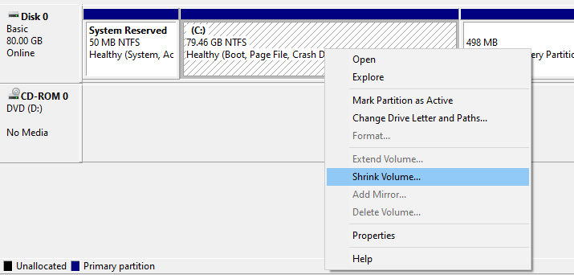
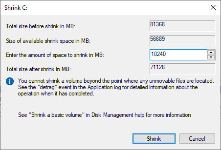
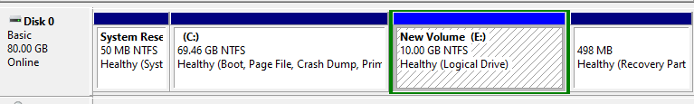
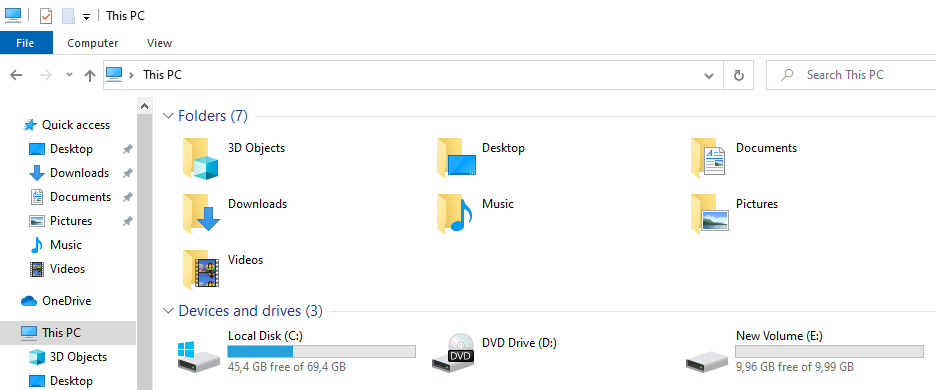
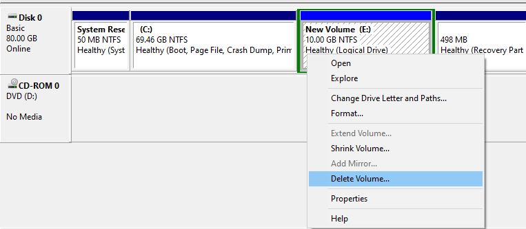
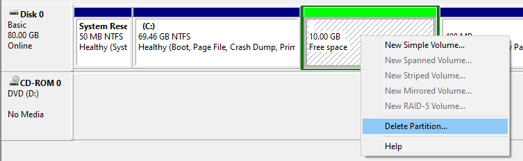
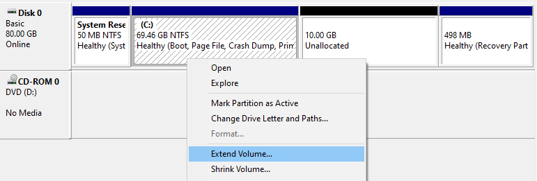
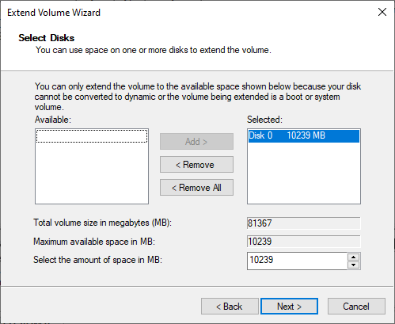

# Splitting a Partition

***

Most pre-built and OEM Computers that come with Windows pre-installed usually only have one Hard Drive installed and have one partition that spans the entire Hard Drive. If we want to save our data and do not have any other options available to keep the data on external Hard Drives, Thumb Drives or into the Cloud, we can still make do with some tricks. Since the files are on the partition `Local Disk (C:)`, we can split available space from this partition and make a new partition out of it.

Albeit there are some limitations we have to be aware of doing so:

- there needs to be enough free space available that we can split away
- We can only take a maximum of 50% of the maximum size of the partition
- there should still be 10% of free space available on the partition after splitting

## Example 1

All the files we want to save are inside the `C:\Users\MyName` folder. The folder is 600 GB large and contains many images and
video files. We already used all the suggestions from [Making Space](../making-space/) to free up some space. The partition has a size of 1 TB (1024 GB), and all together, 850 GB are in use (our files, installed programs, MS Windows).

Since we are about to install Windows 10 and delete the entire partition in the process, we might uninstall some of the more extensive programs
via `⊞ Win > Control Panel > Programs and Features`. Before uninstalling a program, we might want to write it down on a list, see [Pre-Install Backup](../pre-install-backup/). We gain 60 GB of extra free space in this example for 234 GB.

We do not have the required free space for a full copy of the `C:\Users\MyName` folder. The best we could do is:

- total partition space: 1024 GB
- current used space: 790 GB (77%), free space 234 GB (23%)
- space we can use to split: ~ 150 GB,

because the new total volume size will then be 874 GB, which means 790 GB will then take 90% of available space, leaving 10% free. So, at best, we can get away with 150 GB. My recommendation for this example would be to buy an external Hard Disk with 2TB (or more).

## Example 2

The entire partition spanning over the Hard Drive is 1 TB again, but this time the files in `C:\Users\MyName` only use 45 GB. We have already cleaned up all unnecessary data and uninstalled most programs. The total space used is 300 GB.

- total partition space: 1024 GB
- current used space: 300 GB (30%), free space: ~700 GB (70%)
- we have more than 50% of the total space available and could split up to 512 GB

However, we only need 45 GB. We add a 10% safety margin and split 50GB from `Local Disk (C:)`.

## Using the MS Windows Disk Management

To open the `Disk Management Tool`, we need first to open the `Computer Management` tool. To do so, we press the `⊞ Win` - key and type `Computer Management` into the Task Bar Search. Alternatively, we can navigate to `⊞ Win > Windows Administrative Tools > Computer Management`. On the left inside the `Computer Management`, we click on `Disk Management` and will see an overview of all available Hard Drives and their partitioning:

We can ignore the small extra partitions on the Hard Drive, as MS Windows needs them to function correctly.

In this example, we want to split 10 GB from the primary partition. To do so, we right-click on the primary partition and select `Shrink Volume...`

Now we enter the amount we want to split: 10 * 1024 MB = 10240 MB = 10 GB

Our actions result in 10 GB of unallocated space, meaning there is no partition on it yet, and can't be used. We can quickly fix this by right-clicking on the now unallocated space and select `New Simple Volume...`

A `New Volume Wizard` will pop up, where we could select multiple options to create the new volume. However, no pre-selected option needs any change, so we can just hit `Next` on each page (We want to allocate the entire available space, assign a drive letter to it and format the new partition with NTFS). The resulting confirmation screen should look like this, apart from the size and possibly the drive letter:

We confirm our selection and click on `Finish`. The new partition will be created and will show up as a new "drive" in our `This PC` Window:

We can now create folders and copy and paste (or move) data to this new partition. All the files on this partition will be safe during the installation of Windows 10.

After said installation and the re-formatting of the primary partition, and **after** we copied all the data back, we can reverse the process again. We need to go back into the `Disk Management Tool`, delete the volume and merge the unallocated space back. Be careful to select the correct partition to delete:

!!! danger "Important"
    The process of deleting the NTFS partition is irreversible and will delete all data from the selected volume.

**Note:** We want to extend the primary partition with the unallocated space. Therefore we need to right-click on the partition labelled `(C:)`.

